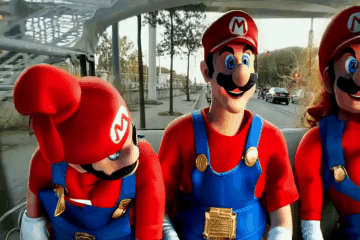
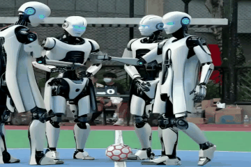
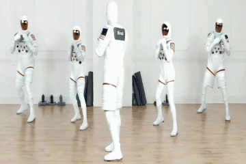
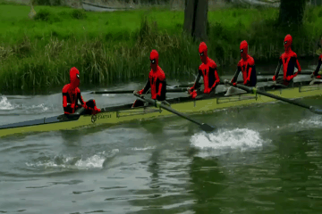
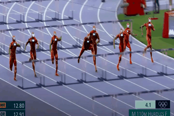

# 🎬ASTRA🎬: Let Arbitrary Subjects Transform in Video Editing

[](https://muzishen.github.io/ASTRA/)
[](https://arxiv.org/pdf/2510.01186)
[](https://huggingface.co/datasets/happywork/MSVBench)
[](https://github.com/XWH-A/ASTRA)

---

**ASTRA: Let Arbitrary Subjects Transform in Video Editing [[Project](https://muzishen.github.io/ASTRA/)] [[Code](https://github.com/XWH-A/ASTRA)]** <br />  
[Fei Shen](https://muzishen.github.io/), [Weihao Xu](https://github.com/XWH-A/), [Rui Yan](https://ruiyan1995.github.io/), [Dong Zhang](https://dongzhang89.github.io/), [Xiangbo Shu](https://shuxb104.github.io/), [Jinhui Tang](https://scholar.google.com/citations?user=ByBLlEwAAAAJ&hl=en), Maocheng Zhao <br />


---

## 📅 Release
- [2025/10/13] 🎉 We release the Inference code, Evaluate metric code and MSVBench dataset.
- [2025/10/01] 🎉 We launch the [project page](https://muzishen.github.io/ASTRA/) of ASTRA.

---

## 🚀 Key Features
1. Training-Free, Arbitrary Subjects: **ASTRA** (arbitrary-subjects training-free retargeting and alignment) transforms any number of designated subjects in open-domain video without finetuning or retraining, while strictly preserving the background and non-target regions.  
2. Prompt-Guided Multimodal Alignment: Leverages large foundation models—e.g., a text-to-image prior plus a vision–language model—to produce aligned multimodal conditions (augmented text and visual instructions), mitigating insufficient prompt-side conditioning and attention dilution in dense, multi-subject layouts.  
3. Prior-Based Mask Retargeting: Tracks per-frame mask state transitions to obtain temporally coherent mask motion that follows source dynamics, alleviating mask boundary entanglement and attribute leakage under heavy occlusion and crowded scenes.  
4. Plug-and-Play with Mask-Driven Video Models: Drop-in compatible with diverse mask-driven video generators; on MSVBench (100 challenging sequences spanning varying subject counts and interactions), **ASTRA** consistently surpasses strong baselines in multi-subject editing.

---

## 💡 Introduction
Generative models have advanced video editing, yet many methods still focus on single or few subjects and degrade in complex multi-subject settings. In dense layouts with heavy occlusions, common failure modes include mask boundary entanglement, attention dilution, attribute leakage, and temporal instability—edits bleed across instances or drift away from the text prompt.

We present **ASTRA** (arbitrary-subjects training-free retargeting and alignment), a framework for mask-driven, text-guided editing where an arbitrary number of designated subjects are transformed while the background and non-target regions stay intact—with no model finetuning. **ASTRA** couples two modules with a pretrained mask-driven video generator:  
- Prompt-guided multimodal alignment isolates target subjects in the prompt, queries a visual prior from a text-to-image model, and uses a vision–language model to fuse prompt and prior into strong multimodal conditioning.  
- Prior-based mask retargeting propagates masks over time so that mask motion stays consistent with the source video, reducing entanglement-driven errors.  

These conditions and mask sequences are fed into the generator to synthesize the edited video. **ASTRA** is a versatile plug-in for different mask-driven backbones. We also introduce MSVBench, a multi-subject benchmark of 100 challenging clips covering diverse subject counts, interactions, and scene complexity; experiments show **ASTRA** consistently outperforms state-of-the-art methods. Code, models, and data are available at [this repository](https://github.com/XWH-A/ASTRA).

---

## 🔥 Examples

<table align="center">
  <tr>
    <td align="center" width="450">
      
      
      <br>
      <sub>Three [People -> Super Mario] sitting in car backseat.</sub>
    </td>
    <td align="center" width="450">
      
      
      <br>
      <sub>Four [People -> Robots] standing on football court.</sub>
    </td>
  </tr>
  <tr>
    <td align="center" width="450">
      
      
      <br>
      <sub>Four [Hungry Dogs -> Robot Wolves] surrounding a bowl of food outdoors.</sub>
    </td>
    <td align="center" width="450">
      
      
      <br>
      <sub>A group of [People -> Astronauts] practicing boxing in a fitness studio.</sub>
    </td>
  </tr>
  <tr>
    <td align="center" width="450">
      
      
      <br>
      <sub>A team of [Men -> Spider-Men] rowing together on a river.</sub>
    </td>
    <td align="center" width="450">
      
      
      <br>
      <sub>Eight [Hurdlers -> Iron Men] leap mid-race over purple hurdles.</sub>
    </td>
  </tr>
</table>

### 🌈Multi-Scenario Applications
<table align="center">
  <tr>
    <td align="center" width="450">
      
      
      <br>
      <sub>Automn Forest -> Winter Forest</sub>
    </td>
    <td align="center" width="450">
      
      
      <br>
      <sub>Snowy Forest -> Lunar Surface</sub>
    </td>
  </tr>
  <tr>
    <td align="center" width="450">
      
      
      <br>
      <sub>The Eiffel Tower -> The Space Needle</sub>
    </td>
    <td align="center" width="450">
      
      
      <br>
      <sub>Glasses -> Sunglasses</sub>
    </td>
  </tr>
  <tr>
    <td align="center" width="450">
      
      
      <br>
      <sub>Left -> Ultraman; Right -> Robot</sub>
    </td>
    <td align="center" width="450">
      
      
      <br>
      <sub>Left -> Gorilla; Right -> Polar Bear</sub>
    </td>
  </tr>
  <tr>
    <td align="center" width="450">
      
      
      <br>
      <sub>Left -> Lightning McQueen; Right -> Yellow Cartoon Porsche</sub>
    </td>
    <td align="center" width="450">
      
      
      <br>
      <sub>Two People (arm wrestling) -> Two Supermen</sub>
    </td>
  </tr>
  
</table>
<table align="center">
  <tr>
    <td align="center" width="280">
      
      <br>
      <sub>Original Video</sub>
    </td>
    <td align="center" width="280">
      
      <br>
      <sub>Turn 1: Horse Riders -> Gokus</sub>
    </td>
    <td align="center" width="280">
      
      <br>
      <sub>Turn 2: The two above (Gokus -> Iron-Men)</sub>
    </td>
  </tr>
</table>
<table align="center">
  <table align="center">
  <tr>
    <td align="center" width="225">
      
      <br>
      <sub>Original Video</sub>
    </td>
    <td align="center" width="225">
      
      <br>
      <sub>Add Glasses    </sub>
    </td>
    <td align="center" width="225">
      
      <br>
      <sub>Change Face To "Durant"</sub>
    </td>
    <td align="center" width="225">
      
      <br>
      <sub>Change Face To "James"</sub>
    </td>
  </tr>
  <tr>
    <td align="center" width="225">
      
      <br>
      <sub>Original Video</sub>
    </td>
    <td align="center" width="225">
      
      <br>
      <sub>Remove Glasses</sub>
    </td>
    <td align="center" width="225">
      
      <br>
      <sub>Plaid Shirt -> Business Suit</sub>
    </td>
    <td align="center" width="225">
      
      <br>
      <sub>Plaid Shirt -> Hawaiian Shirt</sub>
    </td>
  </tr>
</table>
</table>


## 🔧 Requirements
Our method is tested using CUDA 12.2/12.4, Python 3.10.13, and PyTorch >= 2.5.1 on a single A800.
<!-- - Python >= 3.8 (Recommend to use [Anaconda](https://www.anaconda.com/download/#linux) or [Miniconda](https://docs.conda.io/en/latest/miniconda.html))
- [PyTorch >= 2.0.0](https://pytorch.org/)
- cuda==12.2 -->

```bash
git clone https://github.com/XWH-A/ASTRA.git
cd ASTRA
pip install torch==2.5.1 torchvision==0.20.1 torchaudio==2.5.1 --index-url https://download.pytorch.org/whl/cu121
pip install -r requirements.txt
```
If you want to use the Evaluate metric code, you need to additionally configure [GroundingDINO](https://github.com/IDEA-Research/GroundingDINO).


---


## 🌐 Download Weights
The required weights can be downloaded from Hugging Face. Below is a list of the weights you need to download, along with the links.
- [stable-diffusion-xl-base-1.0](https://huggingface.co/stabilityai/stable-diffusion-xl-base-1.0)
- [Video-Depth-Anything-Large](https://huggingface.co/depth-anything/Video-Depth-Anything-Large)
- [Qwen2.5-VL-32B-Instruct](https://huggingface.co/Qwen/Qwen2.5-VL-32B-Instruct)
- [Wan2.1-VACE-1.3B](https://huggingface.co/Wan-AI/Wan2.1-VACE-1.3B)


## 🎉 How to Use

### <span style="color:red">Important Reminder</span>
Before executing the following command, you should first modify the path in the run.sh file to your own correct path.
```sh
bash run.sh
```
If you want to make your own data for testing, we recommend you use [Grounded-SAM-2](https://github.com/IDEA-Research/Grounded-SAM-2) to make your video mask.

## 🙏 Acknowledgement
We thank the contributors of [WAN](https://github.com/Wan-Video/Wan2.1), [VACE](https://github.com/ali-vilab/VACE),[SDXL](https://github.com/Stability-AI/generative-models),[Qwen-VL](https://github.com/QwenLM/Qwen-VL),[Grounded-SAM-2](https://github.com/IDEA-Research/Grounded-SAM-2),[Depth-Anything-V2](https://github.com/DepthAnything/Depth-Anything-V2), for their open research and inspiration.  

The ASTRA code is released for **academic use**. Users must comply with local laws and take responsibility for their own generations. The authors disclaim liability for misuse.  

---

## 📝 Citation
If you find ASTRA useful for your research, please cite:  

```bibtex
@article{shen2026astra,
  title={{ASTRA}: Let Arbitrary Subjects Transform in Video Editing},
  author={Shen, Fei and Xu, Weihao and Yan, Rui and Zhang, Dong and Shu, Xiangbo and Tang, Jinhui and Zhao, Maocheng},
  journal={IEEE Transactions on Multimedia},
  year={2026},
  note={arXiv:2510.01186}
}

```

## 🕒 TODO List
<!-- - [x] Gradio demo -->
<!-- - [x] Inference code -->
<!-- - [x] Model weights (512 sized version) -->
<!-- - [x] Support inpaint -->
<!-- - [ ] Model weights (More higher sized version) -->
- [x] Paper
- [x] Inference Code
- [x] Evaluate metric code
- [x] MSVBench dataset
- [ ] Others, such as User-Needed Requirements
<!-- - [x] Training code -->
<!-- - [ ] Video Dressing -->

## 👉 **Our other projects:**  
- [ASTRA](https://github.com/XWH-A/ASTRA): Arbitrary-subject, training-free video editing with multimodal alignment and mask retargeting (MSVBench). [多主体视频编辑 / 免训练对齐与掩码重定向]
- [IMAGDressing](https://github.com/muzishen/IMAGDressing): Controllable dressing generation. [可控穿衣生成]
- [IMAGGarment](https://github.com/muzishen/IMAGGarment): Fine-grained controllable garment generation.  [可控服装生成]
- [IMAGHarmony](https://github.com/muzishen/IMAGHarmony): Controllable image editing with consistent object layout.  [可控多目标图像编辑]
- [IMAGPose](https://github.com/muzishen/IMAGPose): Pose-guided person generation with high fidelity.  [可控多模式人物生成]
- [RCDMs](https://github.com/muzishen/RCDMs): Rich-contextual conditional diffusion for story visualization.  [可控故事生成]
- [PCDMs](https://github.com/tencent-ailab/PCDMs): Progressive conditional diffusion for pose-guided image synthesis. [可控人物生成]
- [V-Express](https://github.com/tencent-ailab/V-Express/): Explores strong and weak conditional relationships for portrait video generation. [可控数字人生成]
- [FaceShot](https://github.com/open-mmlab/FaceShot/): Talkingface plugin for any character. [可控动漫数字人生成]
- [CharacterShot](https://github.com/Jeoyal/CharacterShot): Controllable and consistent 4D character animation framework. [可控4D角色生成]
- [StyleTailor](https://github.com/mahb-THU/StyleTailor): An Agent for personalized fashion styling. [个性化时尚Agent]
- [SignVip](https://github.com/umnooob/signvip/): Controllable sign language video generation. [可控手语生成]


## 📨 Contact
If you have any questions, please feel free to contact with whxu@njust.edu.cn at  or shenfei29@nus.edu.sg.
